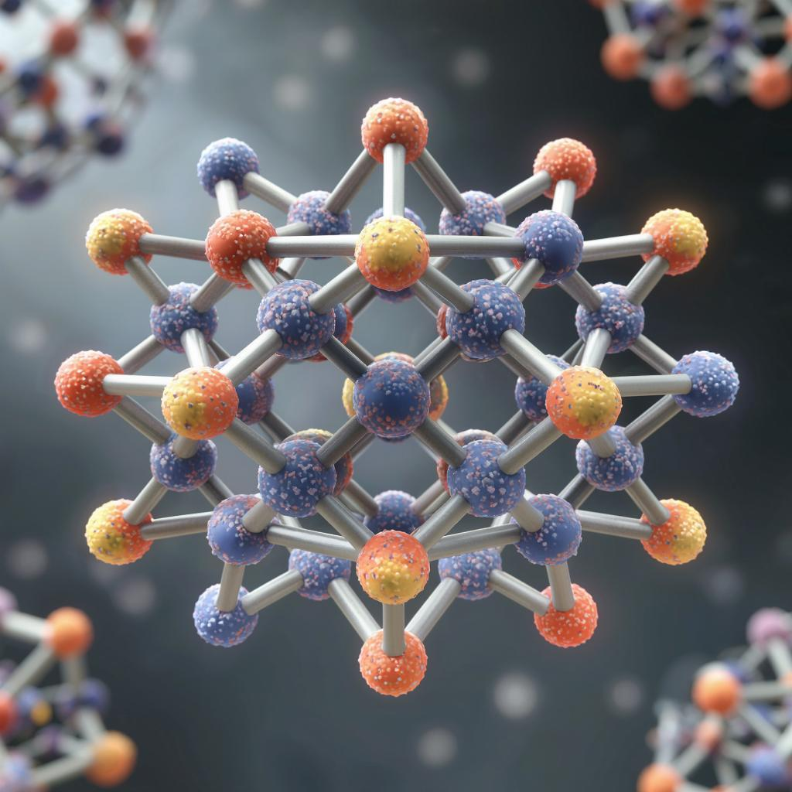

  

# CSSlib

CSSlib is an open-source code for building configuration search space (CSS) of disordered crystals.

Installation
-----
**CSSlib** requires **Supercell** program. Details on **Supercell** installation can be found at the corresponding [website](https://orex.github.io/supercell/download/).

Tutorial
-----
The best way to learn how to use **CSSlib** is through the [tutorial notebook](csslib_example.ipynb).

References & Citing
-----
If you use this code, please consider citing works that actively used the CSS approach, which resulted in the creation of this library:

1. A.V. Krautsou, I.S. Humonen, V.D. Lazarev, R.A. Eremin, S.A. Budennyy 
   "Impact of crystal structure symmetry in training datasets on GNN-based energy assessments for chemically disordered CsPbI3" 
   https://doi.org/10.1038/s41598-025-92669-3
2. N.A. Matsokin, R.A. Eremin, A.A. Kuznetsova, I.S. Humonen, A.V. Krautsou, V.D. Lazarev, Y.Z. Vassilyeva, A.Y. Pak, S.A. Budennyy, A.G. Kvashnin, A.A. Osiptsov 
   "Discovery of chemically modified higher tungsten boride by means of hybrid GNN/DFT approach" 
   https://doi.org/10.1038/s41524-025-01628-z
3. R.A. Zaripov, R.A. Eremin, I.S. Humonen, A.V. Krautsou, V.V. Kuznetsov, K.E. GermanS, S.A. Budennyy, S.V. Levchenko 
   "First-principles data-driven approach for assessment of stability of Tc-C systems" 
   https://doi.org/10.1016/j.actamat.2025.121704
